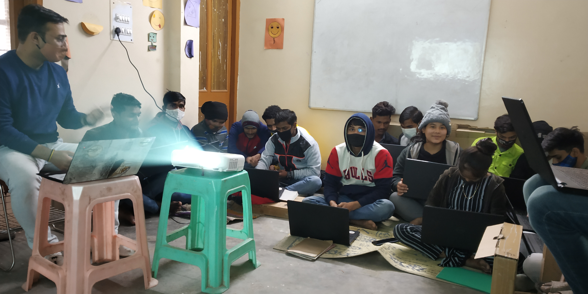
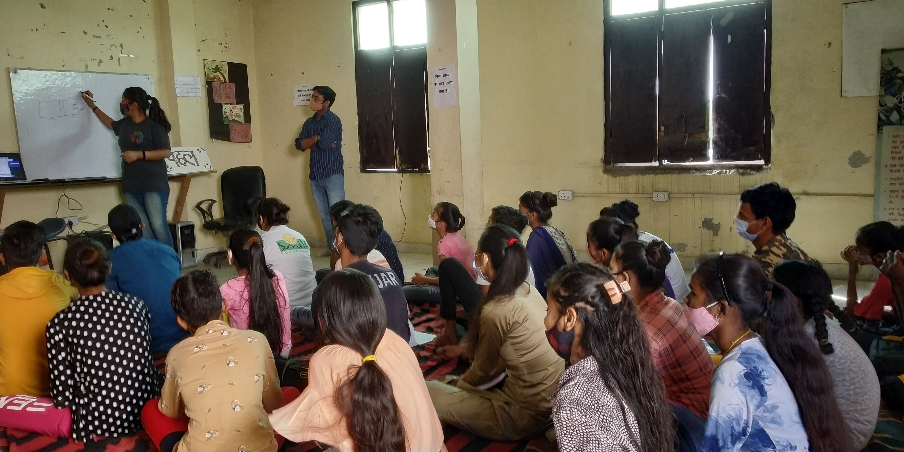
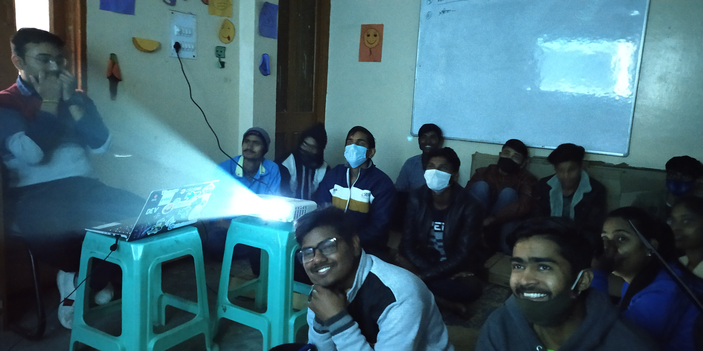
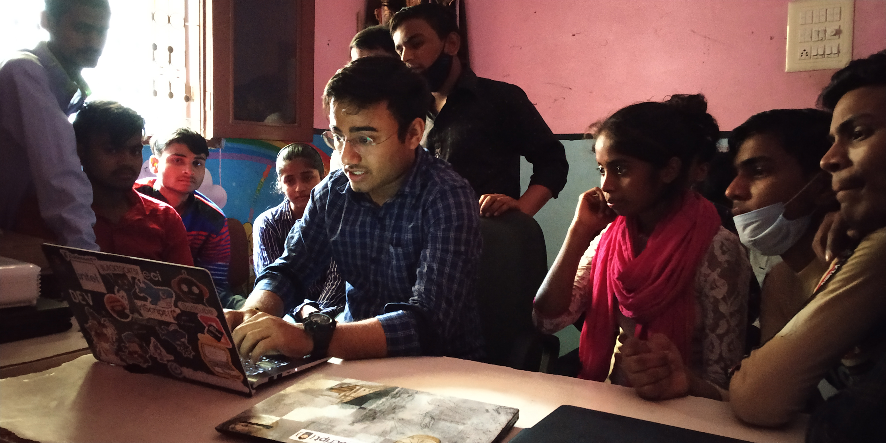

<!-- HEADING -->
<h1 align="center">GirlScript Foundation  
      
     <b>"Tech In Slum"</b>    
</h1>

<!-- INTRODUCTION -->

  
    

Lorem Ipsum is simply dummy text of the printing and typesetting industry. Lorem Ipsum has been the industry's
    standard dummy text ever since the 1500s, when an unknown printer took a galley of type and scrambled it to make a
    type specimen book. It has survived not only five centuries, but also the leap into electronic typesetting,
    remaining essentially unchanged. It was popularised in the 1960s with the release of Letraset sheets containing
    Lorem Ipsum passages, and more recently with desktop publishing software like Aldus PageMaker including versions of
    Lorem Ipsum.
    

<!-- IMPACT -->
<h3 align="center"><b>Impacted over 100+ Students</b></h3>

    

    
<h3 align="center"><b>Impacted over 3+ NGOs</b></h3>

    

    
<h3 align="center"><b>Working hard for the Community</b></h3>

    

<!-- TECHNOLOGIES LEARNED -->
<!-- <h2 align="center">We have taught the latest Technologies</h2> -->

<!-- <a href="https://github.com/omrajsharma/girlscript-tech-in-slum-project/tree/main/projects">Student's Work</a> -->