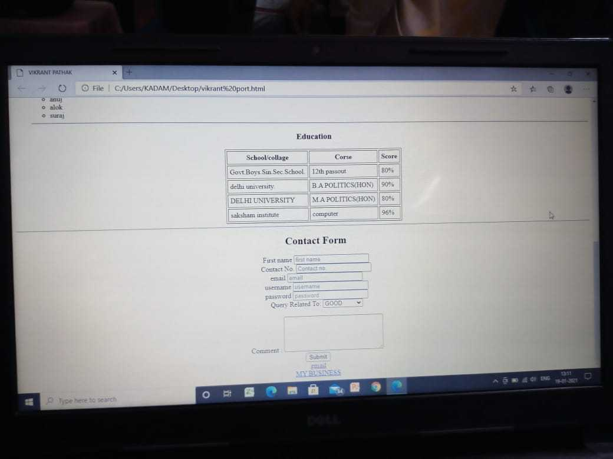
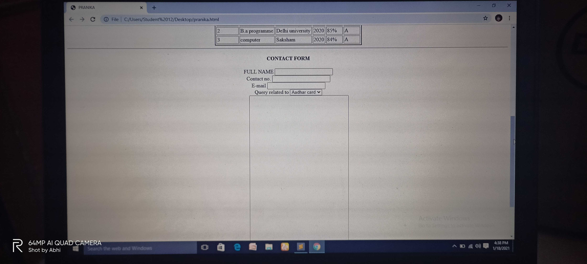
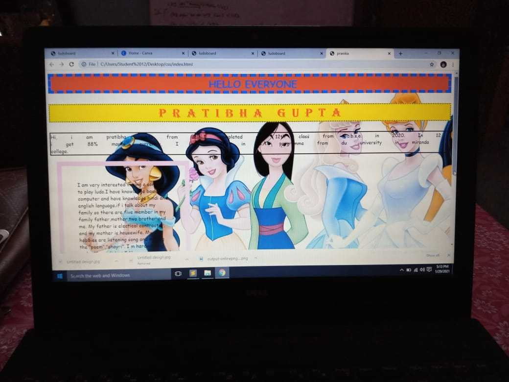
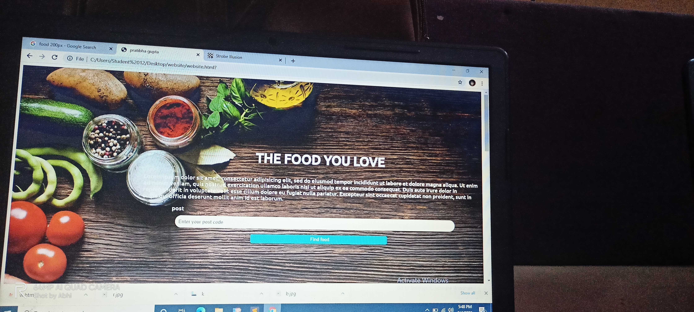
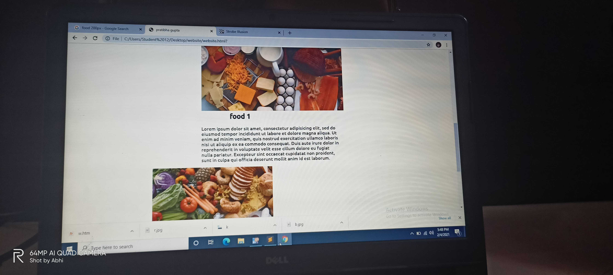
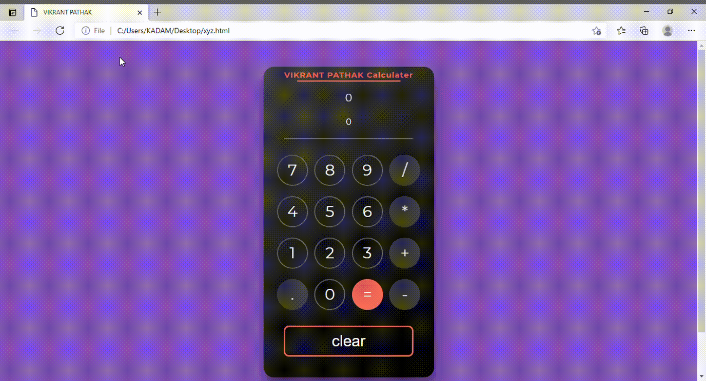
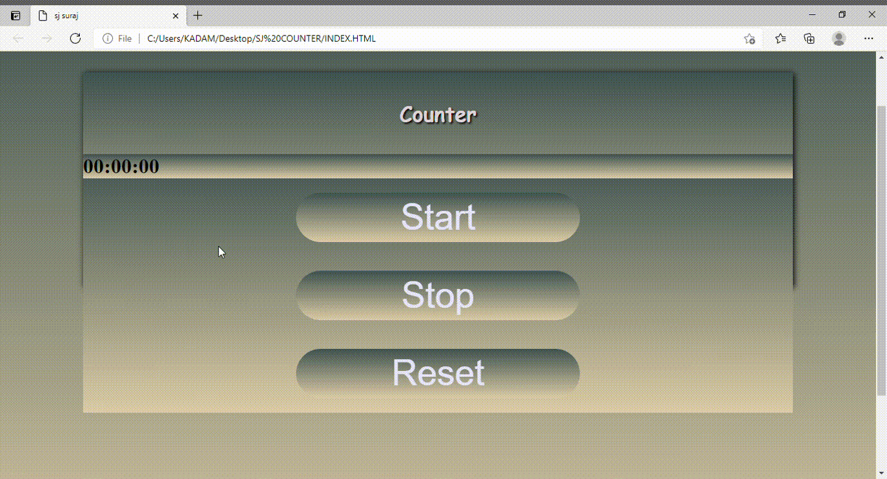
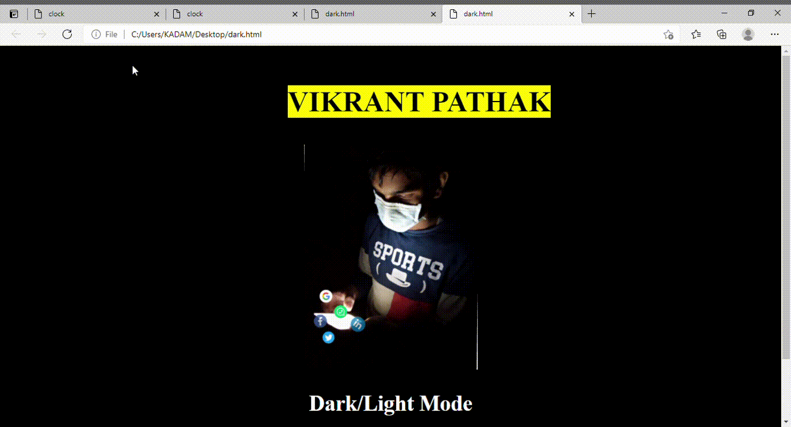

<h1 align="center"><b>Projects</b></h1>

<h2 align="center"><b>SAKSHAM NGO</b></h2>

<h3>HTML Projects</h3>

(Portfolio webpage)

    
    
    
    
    
    
    
    
    
    
    
    
     
     
     
     
     

<h3>CSS Projects</h3>

(Custom Website)

    
    
    
    
    
    
    
    
    
    
     
     
     
     
     

<h3>JavaScript Projects</h3>

(Awesome JS Projects)

    
    
    
     
     
     
     
     
    

